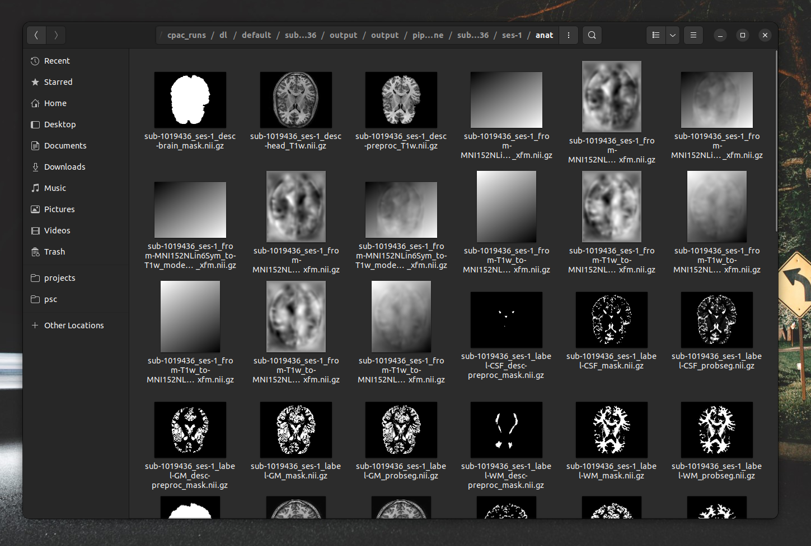
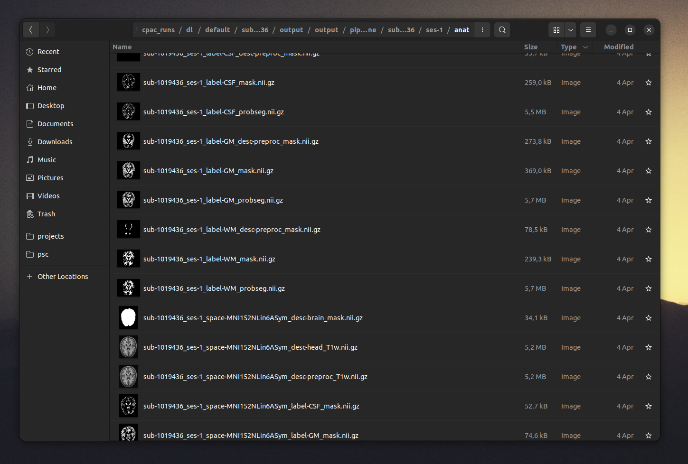

# neurothumb

Neuroimaging file thumbnail generator and integration.





## Installation

PSA: This is a working prototype. Prebuilt binaries and automatic install scripts will be provided in the future.

We are also working on supporting more file formats (Nifti2, surface files) and systems (Windows, MacOS)

### Ubuntu/Gnome/Nautilus

Add nifti mime types and thumbnailer entry.

```bash
sudo cp integration/gnome/neurothumb.xml /usr/share/mime/packages/neurothumb.xml
sudo update-mime-database /usr/share/mime
sudo cp integration/gnome/neurothumb.thumbnailer /usr/share/thumbnailers/neurothumb.thumbnailer
```

Build neurothumb application and copy it to system.

```bash
cargo build --release
sudo cp target/release/neurothumb /usr/bin/neurothumb
```

**Optional:** Restart nautilus and clear thumbnail cache.

```bash
nautilus -q
rm -r ~/.cache/thumbnails
```

**Optional:** There is a default file size limit (50MB) in nautilus. For files bigger than that no thumbnailes will be generated.
If you want to increase this limit you can do (e.g. for 500MB):

```bash
gsettings set org.gnome.nautilus.preferences thumbnail-limit 500
```
